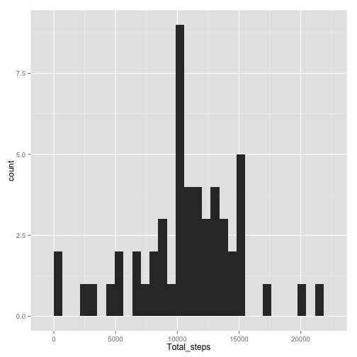
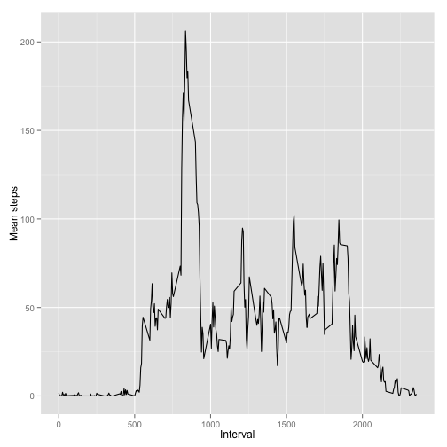
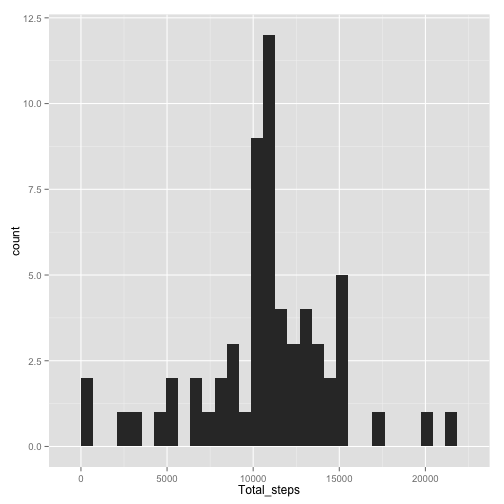
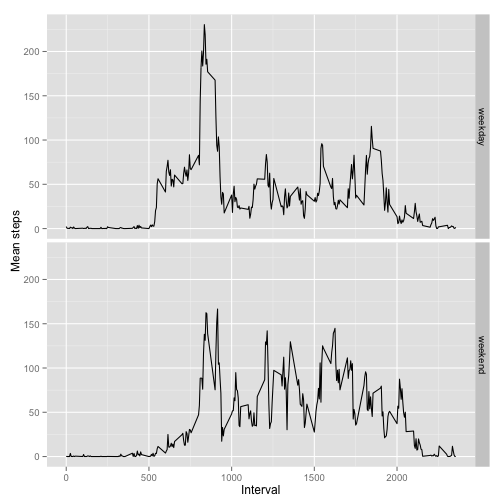

##Loading libraries 

```r
library(ggplot2)
library(tidyr)
library(dplyr)
```

```
## 
## Attaching package: 'dplyr'
## 
## The following object is masked from 'package:stats':
## 
##     filter
## 
## The following objects are masked from 'package:base':
## 
##     intersect, setdiff, setequal, union
```
##Loading and Preprocessing Data


```r
activity <- read.csv("activity.csv")
str(activity)
```

```
## 'data.frame':	17568 obs. of  3 variables:
##  $ steps   : int  NA NA NA NA NA NA NA NA NA NA ...
##  $ date    : Factor w/ 61 levels "2012-10-01","2012-10-02",..: 1 1 1 1 1 1 1 1 1 1 ...
##  $ interval: int  0 5 10 15 20 25 30 35 40 45 ...
```

```r
head(activity)
```

```
##   steps       date interval
## 1    NA 2012-10-01        0
## 2    NA 2012-10-01        5
## 3    NA 2012-10-01       10
## 4    NA 2012-10-01       15
## 5    NA 2012-10-01       20
## 6    NA 2012-10-01       25
```


##What is mean total number of steps taken per day?

For this part of the assignment, we can  ignore the missing values in the dataset.

### Make a histogram of the total number of steps taken each day


```r
#removing the NA cases
act_complete <- activity[complete.cases(activity),]
#checking the structure
str(act_complete)
```

```
## 'data.frame':	15264 obs. of  3 variables:
##  $ steps   : int  0 0 0 0 0 0 0 0 0 0 ...
##  $ date    : Factor w/ 61 levels "2012-10-01","2012-10-02",..: 2 2 2 2 2 2 2 2 2 2 ...
##  $ interval: int  0 5 10 15 20 25 30 35 40 45 ...
```

```r
#grouping on date
act_day <- group_by(act_complete,date)
#finding the total steps by day
act_graph1 <- summarize(act_day,Total_steps = sum(steps))
#drawing the graph
qplot(Total_steps,data=act_graph1,geom="histogram")
```

```
## stat_bin: binwidth defaulted to range/30. Use 'binwidth = x' to adjust this.
```

 


###Calculate and report the mean and median total number of steps taken per day

 

```r
a <- mean(act_graph1$Total_steps)
```
The mean of the total number of steps per day is 10766.19


```r
b <- median(act_graph1$Total_steps)
```
The median of the total number of steps per day is 10765

##What is the average daily activity pattern?

###Make a time series plot (i.e. type = "l") of the 5-minute interval (x-axis) and the average number of steps taken, averaged across all days (y-axis)


```r
#grouping by interval 
act_interval <- group_by(act_complete,interval)
# calculating mean steps
act_graph2 <- summarize(act_interval,mean_steps = mean(steps))
#drawing the graph 
g <- ggplot(act_graph2,aes(interval,mean_steps))
g+geom_line()+labs(x = "Interval",y = "Mean steps")
```

 


###Which 5-minute interval, on average across all the days in the dataset, contains the maximum number of steps?


```r
#finding out which is the max of steps and then finding out the corresponding interval
 a<-  act_graph2[which(act_graph2$mean_steps == max(act_graph2$mean_steps)),1]
```

The five minute interval which has the maximum number of steps is 835

##Imputing missing values

###    Calculate and report the total number of missing values in the dataset 


```r
no_missing_dates <- sum(is.na(activity$date))

no_missing_steps <- sum(is.na(activity$steps))


no_missing_interval <- sum(is.na(activity$interval))
```

###The number of missing dates is 0

###The number of missing steps is 2304

###The number of missing intervals is 0

### Devise a strategy for filling in all of the missing values in the dataset. The strategy does not need to be sophisticated. For example, you could use the mean/median for that day, or the mean for that 5-minute interval, etc.

The strategy I have decided to follow is to replace all the NA's with the corresponding mean steps for that particular interval

### Create a new dataset that is equal to the original dataset but with the missing data filled in.


```r
# creating a copy of activity
activity_impute <- activity
#finding out which steps are NA and then replacing them with the corresponding mean steps of the corresponding interval
activity_impute[which(is.na(activity$steps)),1] <- act_graph2[match(act_graph2$interval,activity[which(is.na(activity$steps)),3]),2]
# calculing the number of NA to make sure it is NIL and all NAs are replaced
sum(is.na(activity_impute$steps))
```

```
## [1] 0
```

### Make a histogram of the total number of steps taken each day  


```r
#grouping by date
act_imp_day <- group_by(activity_impute,date)
#finding out the total number of steps 
act_graph3 <- summarize(act_imp_day,Total_steps = sum(steps))
#drawing the graph
qplot(Total_steps,data=act_graph3,geom="histogram")
```

```
## stat_bin: binwidth defaulted to range/30. Use 'binwidth = x' to adjust this.
```

 

###Calculate and report the mean  total number of steps taken per day.


```r
#The mean of the imputed data
a  <- mean(act_graph3$Total_steps)
```
The mean of the imputed data is 1.0766189 &times; 10<sup>4</sup>

###Calculate and report the median total number of steps taken per day.


```r
#The median of the imputed data
a <- median(act_graph3$Total_steps)
```

The median of the imputed data is 1.0766189 &times; 10<sup>4</sup>

###Do these values differ from the estimates from the first part of the assignment? What is the impact of imputing missing data on the estimates of the total daily number of steps?

The values do differ from the orginal calculations. The impact of replacing NA with the means of intervals resulted in the mean and median of the sample data becoming one and the same. 


##Are there differences in activity patterns between weekdays and weekends


```r
#create a new field and populate with either weekday or weekend 
activity_impute <- mutate(activity_impute,weekend = ifelse(weekdays(as.Date(activity_impute$date)) %in% c("Sunday","Saturday"),"weekend","weekday"))
# convert that field into a factor 
activity_impute <- transform(activity_impute,weekend = factor(weekend))
```


### Make a panel plot containing a time series plot (i.e. type = "l") of the 5-minute interval (x-axis) and the average number of steps taken, averaged across all weekday days or weekend days (y-axis


```r
# group by interval and weekend 
act_imp_interval <- group_by(activity_impute,interval,weekend)
# calculate mean steps 
act_graph4 <- summarize(act_imp_interval,mean_steps = mean(steps))
# draw the graph
g <- ggplot(act_graph4,aes(interval,mean_steps))
g+geom_line()+labs(x = "Interval",y= "Mean steps")+facet_grid(weekend ~ .)
```

 
